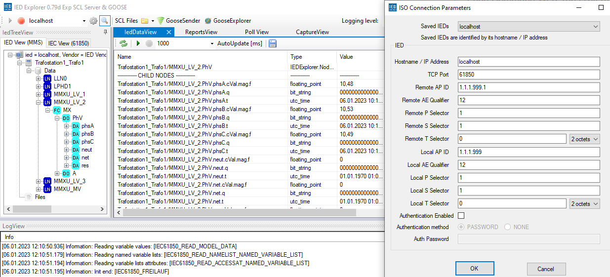

# A Modular Framework for Evaluating Smart Grid Communication Protocols over Mobile Networks

This repository is used to store the experimental setup of the paper "A Modular Framework for Evaluating Smart Grid Communication Protocols over Mobile Networks". It deals with IEC 61850 and IEC 60870-5-104 from the energy industry as well as the IoT protocol MQTT. The aim of this framework is to show the different efficiency of these protocols and their influence on the LTE-M radio cell.

The corresponding docker-compose files are located in the IEC 61850, IEC 104, MQTT folders. With `docker-compose up` in the appropriate directory, the test can be performed locally with a substation and a SCADA application. For example, with `docker-compose iec61850_trafostationen`, only the substation can be started for the IEC 61850 test. The SCADA application provides a REST interface. To start the test, `127.0.0.1:5000/start_test` has to be called. The information retrieved from the substation will then be displayed at the URL '127.0.0.1:5000'.

The IEC 61850 and IEC 104 folders each contain a docker file. This file compiles the C libraries of the protocols and then the Python library based on them. This is built using SWIG. The images can be built using the `docker-compose build` command and run separately for manual testing or debugging.

- [Use case](#use-case)
- [Preliminary investigation over Ethernet](#preliminary-investigation-over-ethernet)
- [Framework](#framework)
- [Hardware RockPI 4b+](#hardware-rockpi-4b)
  - [Preparations](#preparations)
    - [Firmware upgrade Quectel Modem BG95M4](#firmware-upgrade-quectel-modem-bg95m4)
  - [Installation](#installation)
    - [Necessary additional programmes](#necessary-additional-programmes)
    - [Drivers](#drivers)
    - [Establishing the connection](#establishing-the-connection)
    - [Debugging mit Busybox](#debugging-mit-busybox)
    - [Route for SG Traffic over PPP0 Interface](#route-for-sg-traffic-over-ppp0-interface)
    - [Cloning the SD cards](#cloning-the-sd-cards)
    - [Optional settings](#optional-settings)
- [IEC 61850](#iec-61850)
    - [Modifications:](#modifications)
    - [Local trial](#local-trial)
    - [Test API:](#test-api)
    - [Wireshark capture of MMS traffic](#wireshark-capture-of-mms-traffic)
- [IEC 61850-5-104 (IEC 104)](#iec-61850-5-104-iec-104)
    - [Adaptations:](#adaptations)
    - [Local trial](#local-trial-1)
    - [Test execution via API:](#test-execution-via-api)
- [MQTT](#mqtt)
    - [Local trial](#local-trial-2)
    - [Test execution via API:](#test-execution-via-api-1)
- [Amarisoft monitoring](#amarisoft-monitoring)
- [Launch on multiple RockPis using Ansible](#launch-on-multiple-rockpis-using-ansible)


## Use case


We defined two uses case in a typical smart grid to be tested. These use cases, in particular the traffic profiles associated with them, were provided by different energy 
industry companies.

As shown in Figure above, we consider our example substation containing three low-voltage feeders and a medium-voltage feeder. We interviewed energy industry companies about the values and collection methods they typically use. The survey revealed that for each voltage level and feeder, power and reactive power are measured for each of the three phases. For the medium-voltage level, the voltage of all phases to the protective earth neutral conductor is also measured. This results in a total of 27 values per measuring interval. Two models for the interrogation methods are used:

1. The measured values of the medium-voltage and lowvoltage levels are queried every minute.
2. The measured values are transmitted every 15 minutes as the 15-minute average of the individual measured values taken.
 
## Preliminary investigation over Ethernet

For the preliminary investigation, the protocols were transmitted over Ethernet. This was done to better estimate the overhead of the different protocols. It also allowed the effects of individual features to be investigated. The first use case was chosen for the preliminary investigation because most of the packets are exchanged here. This makes it possible to see the differences more clearly.

The keep-alive interval was set to 60 seconds for protocols using keep-alives. The duration of the test is one hour. All packets not originating from the protocol were removed. 

For MQTT, it was observed that the TCP keepalives were still sent every 15 seconds when using a Windows 10 PC with Docker and WSL 2 as the environment. WSL2 appears to have a hardcoded keepalive interval. By running the test on the RockPi hardware, this problem was avoided.

In the captures, the substation container was run on the Rockpi with IP `10.20.111.70` and the SCADA application was run on the one with IP `10.20.111.156`. In the `./Captures/Ethernet/Capt_IEC104_Open_Con_Timer.pcapng` capture, the IEC 104 T2/T3 timer was increased. In the IEC 61850 trial, the `configRev` variable was retrieved only once at the beginning of the trial period.

| Protocol              | Total packages | packages SCADA -> substation | packages substation -> SCADA |  Total bytes | Bytes SCADA -> substation | Bytes substation -> SCADA |
| ---------------------- | ---------------- | ---------------------------- | ---------------------------- | --------------- | --------------------------- | --------------------------- |
| IEC61850 Con Closing   | 1.218            | 669                          | 549                          | 172,8 KiB       | 76,5 KiB                    | 96,3 KiB                    |
| IEC61850 Con Open      | 2.783            | 1.810                        | 973                          | 346,2 KiB       | 197,3 KiB                   | 148,9 KiB                   |
| IEC61850 Con Open Timer| 632              | 376                          | 256                          | 112,7 KiB       | 45,1 KiB                    | 67,6 KiB                    |
| IEC 104 Con Closing    | 1196             | 660                          | 536                          | 96,1 KiB        | 45,5 KiB                    | 50,6 KiB                    |
| IEC 104 Con Open       | 705              | 286                          | 419                          | 61,2 KiB        | 45,5 KiB                    | 50,6 KiB                    |
| IEC 104 Con Open Timer | 260              | 131                          | 129                          | 30,7 KiB        | 8,8 KiB                     | 21,9 KiB                    |
| MQTT Keepalive 60      | 367              | 183                          | 184                          | 76,7 KiB        | 11,9 KiB                    | 64,8 KiB                    |
| MQTT Con Closing       | 720              | 300                          | 420                          | 102 KiB         | 20 KiB                      | 82 KiB                      |

## Framework
In our framework, containers are named according to their function in a smart grid. This means that the container which emulates a specific protocol in a substation is e.g., referred to as “IEC 61850 substation”. Similar, the container that provides the protocol implementation which queries the substations is referred to as SCADA container.


The "measured values" used are provided in the `sample_data.csv`. This can be generated with any length using the 'gen_sample_csv_data.py' tool. All protocols use the same file and thus the same data!

## Hardware RockPI 4b+

The image used is an Armbian image for the RockPi 4b. The image can be found [here](https://www.armbian.com/rockpi4/). Alternatively, an image can be downloaded from the RockPi Github [here](https://github.com/radxa-build/rock-pi-4b/releases/).

This guide uses Armbian 22.11 Jammy Minimal as no GUI is needed. Alternatively, the Armbian 22.11 Jammy XFCE Kernel 5.15.y can be used if a GUI is desired.

The image is flashed to the SD card using a tool such as Rufus or Etcher. The modem is connected to an active USB hub.

### Preparations

#### Firmware upgrade Quectel Modem BG95M4

To update the firmware of your Quectel modem, you will need the Windows Quectel driver and the QFlash utility. Both can be requested from Quectel. Once the programs are installed and the modem is connected, it will appear in the device manager under COM ports. The DM port is relevant here.

See:


Then run the QFlash application, set the COM port to the DM port from the Device Manager and set the baud rate to 460800. Next, load the firmware image using the Load FW Files button. This can be found at BG95M4_Firmware\update\firehose\partition.mbn. The update will then start. The tested firmware is v01.009.


### Installation

#### Necessary additional programmes

Armbian is shipped with SSH access enabled. The default SSH user is "root" with password "1234". Once an SSH connection has been established, the setup wizard must be run.

After installation, the following packages and drivers must be installed. Nano and net-tools are optional.

```shell
sudo apt-get update
sudo apt-get upgrade

# Configuration e.g.: keyboard layout
sudo apt-get install armbian-config
armbian-config

sudo apt-get install linux-headers-current-rockchip64 build-essential ppp busybox dos2unix

# Installing Docker for Debian
curl -fsSL https://get.docker.com -o get-docker.sh
sudo sh get-docker.sh
sudo apt-get install docker-compose
# In the event of an error regarding Apparmor when building the containers
# apt install apparmor
# systemctl restart docker

# Optional tools
sudo apt-get install net-tools nano 

# If the modem manager is to be used further, this step can be skipped.
# Then the following must be done before starting the PPP connection:
# sudo systemctl stop NetworkManager
# sudo systemctl stop ModemManager 
sudo apt-get remove modemmanager && sudo apt-get purge
sudo systemctl stop NetworkManager
```

#### Drivers

Then you need to build the drivers and adapt the PPP script. The adapted PPP script can be found at `/quectel-chat-connect`.

```shell
# drivers from the repo Hardware\Quectel_Linux_USB_Serial_Option_Driver
# and copy quectel-chat-ppp and the other ppp scripts to the RockPi

# Display device names for the USB devices & create mountpoint
# lsblk
# sudo mkdir /media/usb
# sudo mount /dev/sda1 /media/usb
# cd /media/usb

cd Quectel_Linux_USB_Serial_Option_Driver/
uname -r
# Output 5.15.XX-rockchip64
cd v5.15.6/
sudo make ARCH=arm64
sudo make install ARCH=arm64

#cd drivers/usb/serial/
#insmod usb_wwan.ko option.ko qcserial.ko
#rmmod option usb_wwan qcserial #qmi_wwan_q
#insmod usb_wwan.ko option.ko qcserial.ko #qmi_wwan_q.ko 

lsusb -t

# An output with qmi_wwan_q must appear

cd ../../linux-ppp-scripts/
nano quectel-ppp
nano quectel-chat-connect
dos2unix *
sudo cp * /etc/ppp/peers/

sudo pppd call quectel-ppp
```

Adapt PPP scripts (provided scripts already adapted to the test environment):
```shell
# plug in the modem 
# if this does not appear under lsusb:
dmesg | grep tty

cd ./linux-ppp-scripts/

# Make sure that /dev/ttyUSB2 appears.
nano quectel-ppp

# Adjust APN and network name of the radio cell
nano quectel-chat-connect

cp * /etc/ppp/peers/
```

#### Establishing the connection
```shell
# Start Connection Script
sudo pppd call quectel-ppp

# Stop Connection
sudo killall pppd
```
Output:
<div style="text-align:center"></div>

Under ifconfig, ppp0 appears as a interface.

#### Debugging mit Busybox
The AT Command for the Quectel BG95 M4 used can be found [here](https://www.quectel.com/wp-content/uploads/2021/03/Quectel_BG95BG77BG600L_Series_AT_Commands_Manual_V2.0.pdf).
```shell
busybox microcom /dev/ttyUSB2

AT+CREG=?
# Output z.B: +CREG: (1,5) Network active and roaming (Telekom SIM)

# Search for reachable radio cells:
AT+COPS=?
# Output z.B:  err 3 means there is not available network , pls check your SIM card provision
# Output z.B: +COPS: (2,"Amarisoft Network","Amarisof","00101",8),...

# Query registration status:
AT+CREG?
# Output: +CREG: (0,1) Registered, home network
# Output: +CREG: (0,2) Not registered, but MT is currently trying to attach the network or searching an operator to register to

# Change frequency band
AT+QCFG="band",0,0x800000000000080000,0,1
# Activates band 72 (450MHz) and telecom band 20 and applies these changes immediately
# 0x10018200004F0E189F activates all bands for eMTC

# Restart modem to exit busybox
AT+CFUN=1,1
```

#### Route for SG Traffic over PPP0 Interface

Example for MQTT:
```shell
root@rockpi-4b:~# ip rule add dport 1883 table 1883 && ip route add default via 10.64.64.64 table 1883
root@rockpi-4b:~# route
Kernel IP routing table
Destination     Gateway         Genmask         Flags Metric Ref    Use Iface
default         rr-2k00a.infcs. 0.0.0.0         UG    100    0        0 eth0
10.20.111.0     0.0.0.0         255.255.255.0   U     100    0        0 eth0
10.64.64.64     0.0.0.0         255.255.255.255 UH    0      0        0 ppp0
172.17.0.0      0.0.0.0         255.255.0.0     U     0      0        0 docker0
 ...
```

#### Cloning the SD cards

The SD card can be cloned using Balena Etcher.
Please note that the NetworkManager also clones the MAC address. This must be removed, otherwise all Rockpis will have the same IP address.

```shell
nmcli conn edit "Wired connection 1"
print
remove 802-3-ethernet.cloned-mac-address
save
quit
```

#### Optional settings

```shell
sudo hostnamectl set-hostname mallsensor1
sudo nano /etc/hosts
# change rockpi-4 to mallsensor1

# check per dig
sudo apt install dnsutils
dig mallsensor1
```

Create aliases for SSH under Powershell:
```shell
# creates config file without extension
New-Item C:\Users\$env:UserName\.ssh\config
# opens the file in the default editor
Start C:\Users\$env:UserName\.ssh\config
```

Create the hosts in the file. For example:
```
Host amarisoft
  HostName 10.20.111.130
  Port 22
  User root
  
Host server
  HostName 10.20.111.241
  Port 22
  User root

Host sensor1
  HostName 192.168.178.10
  Port 22
  User root
  ProxyJump root@10.20.111.130
...
```

Validate configuration:
```
ssh amarisoft
ssh sensor1
```

## IEC 61850

The IEC 61850 container uses an adapted version of the version published by MZ-Automation (see: [here](https://github.com/mz-automation/libiec61850)). The Framework was tested with v.1.5.1, which can be downloaded [here](https://github.com/mz-automation/libiec61850/tree/v1.5.1). Extract all files in `/IEC 61850/libiec61850`.

The [Modelling Guideline and Sample Modelling with the SCL](https://www.dke.de/resource/blob/1622846/54ac5a80df67f199302335e8ece13421/ak952-0-1-modellierungsrichtlinie-v10-new-data.pdf) was used as a guideline for the implementation of the use case. This guideline recognises the voltage levels 380kV, 110kV and 10kV. In the experiment, the medium voltage of 110kV and the low voltage of 10kV devices are modelled. The medium voltage is represented by an E1_MMXU (type: 110kV E1). This has measured values for, among other things, *total reactive power*, *total active power*, *frequency*, *phase to earth voltages* (3x phase to earth voltage), *phase currents* (3x current). Since, according to the Modelling Guideline, there is no device that transmits exactly the required measured values, it was decided to transmit the nine values listed above, since their magnitude plays a subordinate role. For low voltage, three K2_MMXU devices (type: 10kV K2) are implemented to measure *phase to earth voltages* (3x voltage from phase to earth), *phase currents* (3x current). This choice was also made because there is no accurate instrument that can provide all the required values. The power per phase can theoretically be determined by the SCADA application from the voltages and currents of each phase.

#### Modifications:
The following changes were made (thanks to Smart Grids Research Group TH Ulm https://gitlab.com/thu_smartgrids/pylibiec61850):
```
Changes -> libiec61850\CMakeList.txt -> option(BUILD_PYTHON_BINDINGS "Build Python bindings" ON)
                                     -> option(BUILD_EXAMPLES "Build the examples" OFF)

        -> libiec61850\pyiec61850\CMakeLists.txt
                                     -> find_package(PythonInterp REQUIRED)
                                     -> find_package(PythonLibs REQUIRED)
```

The TCP keepalive interval has been increased from 5 seconds to 60 seconds in `IEC 61850\libiec61850\config\stack_config.h` and `IEC 61850\libiec61850\config\stack_config.h.cmake`.

```c
/* activate TCP keep alive mechanism. 1 -> activate */
#define CONFIG_ACTIVATE_TCP_KEEPALIVE 1

/* time (in s) between last message and first keepalive message */
#define CONFIG_TCP_KEEPALIVE_IDLE 60

/* time between subsequent keepalive messages if no ack received */
#define CONFIG_TCP_KEEPALIVE_INTERVAL 60
```

Furthermore, in the file `IEC 61850\libiec61850\CMakeLists.txt` the options were activated:

```c
set(CONFIG_ACTIVATE_TCP_KEEPALIVE "Activate TCP keepalive" ON)
set(CONFIG_TCP_KEEPALIVE_IDLE 60 CACHE STRING "Keepalive Idle Timer 60s")
set(CONFIG_TCP_KEEPALIVE_INTERVAL 60 CACHE STRING "Keepalive Intervall Timer 60s")
```

#### Local trial

If the experiment is run locally, it is recommended to add the `depends_on` command in the Docker compose file so that the SCADA application starts only after the substation.

```yml
    depends_on:
        - iec61850_trafostation
```

```yml
    environment:
      - SERVERIP=iec61850_trafostation
      - TCPPORT=61850
```

The IED Explorer can be used to test the IEC 61850 substation. This can be downloaded [here](https://sourceforge.net/projects/iedexplorer/). To do this you need to connect to the local host. This is preset. If the port is not 61850, it can be set using the cogwheel button. Once connected, the data structure can be browsed. In the IedDataView it is possible to automatically retrieve the data every 100 seconds using the green *Play* button.



*Important: Docker on Windows uses WSL2. Here, keepalives are always set to a 1ms interval and cannot be changed.*

#### Test API:

The attempt can also be started via CURL command.

```shell
$ docker-compose up
$ curl -X GET http://localhost:5000/start_test
```
#### Wireshark capture of MMS traffic

In order for Wireshark to recognise the MMS traffic correctly, the following must be entered in the settings for the PRES protocol, as described in [this blog post](https://blog.nettedautomation.com/2011/10/wireshark-analyzer-to-encode-mms-goose.html): Syntax Name OID: 1.0.9506.2.1 and Context Id: 3.


Since the default TCP port 102 is not used, the `TKPT port must be set to 61850`.

## IEC 61850-5-104 (IEC 104)

The IEC 104 container uses an adapted version of the one published by MZ-Automation. This was adapted by the contributor Pelle van der Heide to be able to use the C library in Python (see: [here](https://github.com/ellepdesk/lib60870/tree/master)). The Framework was tested with the master branch, which can be downloaded [here](https://github.com/ellepdesk/lib60870). Extract all files in `/IEC 104/lib60870`.

For the modelling, the *Short measured value (FLOAT32)* data type with the IEC104 designation *M_ME_NB_1(11)* values was used. The lengths of the data types were taken from [here](https://infosys.beckhoff.com/english.php?content=../content/1033/tf6500_tc3_iec60870_5_10x/984453899.html).

IEC104 Name   | Datatyp                            | Value range     | lenght        |
------------- | ---------------------------------- | --------------- | ------------- |
M_SP_NA_1(1)  | BOOLEAN                            | True/False      | 1             |
M_ME_NB_1(11) | Measured scaled value              | -32768 ​- +32767 | 3             |
M_ME_TB_1(12) | Measured scaled value with time    | -32768 ​- +32767 | 10            |
M_ME_NC_1(13) | Short measured value               | FLOAT32         | 5             |
M_ME_TF_1(14) | Short measured value with time     | FLOAT32         | 12            |

The *M_DP_NA_1* data type was chosen because the timestamps are not retrieved / transmitted in the other test positions. Furthermore, it was decided to use float values, as IEC 61850 also uses these and the use of scaled values would not be comparable.

#### Adaptations:

The library can be compiled as follows:

``` shell
cd lib60870-C
cmake .
make
sudo make install
sudo ldconfig
```

The TCP keepalive interval has been increased from 5 seconds to 60 seconds in the file `IEC 104\lib60870\lib60870-C\config\lib60870_config.h`.

```c
/* activate TCP keep alive mechanism. 1 -> activate */
#define CONFIG_ACTIVATE_TCP_KEEPALIVE 1

/* time (in s) between last message and first keepalive message */
#define CONFIG_TCP_KEEPALIVE_IDLE 60

/* time between subsequent keepalive messages if no ack received */
#define CONFIG_TCP_KEEPALIVE_INTERVAL 60
```

Furthermore, in the file `IEC 104\lib60870\lib60870-C\CMakeLists.txt` the options were activated:

```c
set(CONFIG_ACTIVATE_TCP_KEEPALIVE "Activate TCP keepalive" ON)
set(CONFIG_TCP_KEEPALIVE_IDLE 60 CACHE STRING "Keepalive Idle Timer 60s")
set(CONFIG_TCP_KEEPALIVE_INTERVAL 60 CACHE STRING "Keepalive Intervall Timer 60s")
```

The parameters for the TESTFR can be adjusted in `IEC 104\lib60870\lib60870-C\src\iec60870\t104\t104_connection.c` for the client and `IEC 104\lib60870\lib60870-C\src\iec60870\t104\t104_slave.c`. These have been adjusted so that the T2 timer corresponds to 60 seconds.
```c
struct sT104ConnectionParameters defaultConnectionParameters = {
    ...
    /* .t0 = */ 60,  // 10 -> 60
    /* .t1 = */ 90,  // 15 -> 90
    /* .t2 = */ 60,  // 10 -> 60
    /* .t3 = */ 120  // 20 -> 120
    ...
};
```

#### Local trial

If the test is run locally, it is recommended that the `depends_on` command is added to the Docker compose file so that the SCADA application only starts when the substation is ready.

```yml
    depends_on:
        - iec104_trafostation
```

The IP address and port on which the test is running can be specified via the environment variables. The host name of the substation container can also be specified as the server IP.

```yml
    environment:
      - SERVERIP=iec104_trafostation
      - TCPPORT=2404
```

The QTester104 tool can be used to test the IEC 104 substation. This can be downloaded [here](https://sourceforge.net/projects/qtester104/). To do this, connect to IP 127.0.0.1, select Point Mapping and send a single command with COA = 1 and command value 100 (Tnterrogation).


The following appears on the substation output:

```shell
iec104_trafostation_1  | 2023-01-06 10:38:40,316 root:INFO:New connection from b'172.28.0.1'
iec104_trafostation_1  | 2023-01-06 10:38:55,020 root:INFO:Received asdu ASDU: C_SC_NA_1(1) oa:2, ca:2, cot:CauseOfTransmission.ACTIVATION
iec104_trafostation_1  | 2023-01-06 10:38:55,020 root:INFO:received single command
iec104_trafostation_1  | 2023-01-06 10:38:55,380 root:INFO:Received interrogation for group 20
```
According to "Description and analysis of IEC 104 Protocol" ([here](https://www.fit.vut.cz/research/publication-file/11570/TR-IEC104.pdf)) p.35, group 20 means *interrogated by general interrogation* and is the interrogation of all values.

#### Test execution via API:

The attempt can be started via CURL command or by visiting the URL `http://localhost:5000/start_test` via the browser.

```shell
$ docker-compose up
$ curl -X GET http://localhost:5000/start_test
```

## MQTT

The MQTT test setup uses the Mosquitto broker application and the Paho Python library on the client side. During the data transfer, a JSON file is published in the topic 'Transformostatio1/Values'. The client does not see any historical data, but only new data arriving after subscribing to the topic.

If the test is performed on a distributed infrastructure, it is assumed that the broker is running on the SCADA side as all substations access the same broker.

#### Local trial

If the test is run locally, it is recommended that the `depends_on` command is added to the Docker compose file so that the SCADA application only starts when the substation is ready.

```yml
    depends_on:
      - mqtt_broker
```

```yml
    environment:
      - SERVERIP=mqtt_broker
      - TCPPORT=1883
      - CLIENT_NAME=SCADA
      - TRAFO_NAME=Trafostation1
```

#### Test execution via API:

The attempt can be started via CURL command or by visiting the URL `http://localhost:5000/start_test` via the browser.

```shell
$ docker-compose up
$ curl -X GET http://localhost:5000/start_test
```

The page is redirected to `http://localhost:5000/`. The web page refreshes every 20 seconds. The web page will not be filled until the next substation publication.

## Amarisoft monitoring

The Amarisoft Callbox is queried via websockets. The tool `/Amarisoft_Monitoring/amarisoft_webapp.py` has been written for this purpose. This tool polls Amarisoft at regular intervals of 1s and writes selected KPIs to a CSV file. These can be analysed after the test.

Monitoring is started with the command `docker-compose up amarisoft_monitoring`. The IP of the Amarisoft is specified in the `docker-compose.yml` file.

In order to reach the RockPis from outside, a forwarding is created on the Amarisoft via script.

```shell
[root@CBC-2020082000 ~]# ./lucas-nat.sh up
Adding mapping for 10.20.111.231 to 192.168.2.4/32
Adding mapping for 10.20.111.232 to 192.168.2.8/32
Adding mapping for 10.20.111.233 to 192.168.2.12/32
Adding mapping for 10.20.111.234 to 192.168.2.16/32
Adding mapping for 10.20.111.235 to 192.168.2.20/32
```


Create diagrams with `plot_diagram.py`.

```shell
pip install pandas plotly packaging
# for exporting figure to pdf
pip install -U kaleido
python ./Amarisoft_Monitoring/plot_diagram.py
```

https://explainshell.com/explain?cmd=mkfifo+remote.pcap+%26%26+ssh+root%4010.20.111.130+%22tcpdump+-s+0+-U+-n+-w+-+-i+lo%22+%3E+remote.pcap

## Launch on multiple RockPis using Ansible

Install Ansible:

```shell
python3 -m pip install --user ansible
```

Adjust `/etc/ansible/hosts` file:

```yml
[all:vars]
ansible_connection=ssh
ansible_user=root
ansible_ssh_pass=Testen123!
ansible_python_interpreter=auto_silent
ansible_ssh_extra_args='-o StrictHostKeyChecking=no'

[servers]
server

[sensors]
sensor1
sensor2
sensor3
sensor4
sensor5

[one]
sensor1

[two]
sensor1
sensor2

[three]
sensor1
sensor2
sensor3

[four]
sensor1
sensor2
sensor3
sensor4
```

validate:

```shell
ansible all --list-hosts
  hosts (6):
    sensor1
    sensor2
    sensor3
    sensor4
    sensor5
    server
```

ping the sensors:

```shell
ansible all -m ping -u root
sensor4 | SUCCESS => {
    "ansible_facts": {
        "discovered_interpreter_python": "/usr/bin/python3"
    },
    "changed": false,
    "ping": "pong"
}
sensor2 | SUCCESS => {
    "ansible_facts": {
        "discovered_interpreter_python": "/usr/bin/python3"
    },
    "changed": false,
    "ping": "pong"
}
sensor3 | SUCCESS => {
    "ansible_facts": {
        "discovered_interpreter_python": "/usr/bin/python3"
    },
    "changed": false,
    "ping": "pong"
}
sensor5 | SUCCESS => {
    "ansible_facts": {
        "discovered_interpreter_python": "/usr/bin/python3"
    },
    "changed": false,
    "ping": "pong"
}
sensor1 | SUCCESS => {
    "ansible_facts": {
        "discovered_interpreter_python": "/usr/bin/python3"
    },
    "changed": false,
    "ping": "pong"
}
server | SUCCESS => {
    "ansible_facts": {
        "discovered_interpreter_python": "/usr/bin/python3"
    },
    "changed": false,
    "ping": "pong"
}
```

Run playbook: (-i ../hosts optional)

```shell
cd /etc/ansible/playbook/
ansible-playbook playbook.yaml
```

customise playbook for more sensors:

```yml
hosts: one # Group of sensors to be addressed by the playbook
strategy: linear # Wait for the task to be completed on all sensors before starting the next task
```